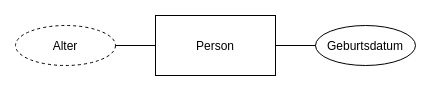
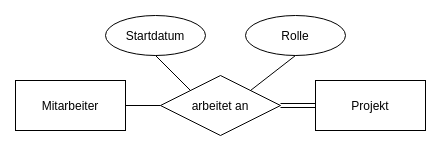
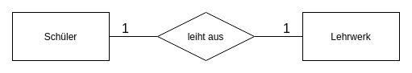
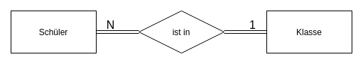

# Entity-Relationship-Modell

Mit dem **Entity-Relationship-Modell** (kurz ER-Modell) lassen sich Realweltausschnitte leicht verständlich
und ohne Implementierungsdetails modellieren. Das Modell wurde 1976 von Peter Chen entwickelt.

Um ein ER-Modell darzustellen, wird ein Entity-Relationship-Diagramm, kurz ER-Diagramm, gezeichnet.

Oft ist ein ER-Modell die Kommunikationsgrundlage zwischen einem Experten der Anwendungsdomäne
und einem Datenbankexperten. Siehe folgendes Beispiel: Ein Chef will deine Mitarbeiter digital in einer Datenbank erfassen.
Er kennt sich aber nicht mit Datenbanken aus und beauftragt einen Informatiker. Damit dieser weiß, wie er die
Datenbank zu implementieren hat, erstellt der Chef ein ER-Diagramm mit allen wichtigen Details.

Auch fertigen Informatiker häufig ein ER-Modell für den Datenbankentwurf an.
Der Vorteil ist, dass zu diesem Zeitpunkt das Datenbankschema noch nicht feststeht. Wie man die Datenbank letztendlich
implementiert (z.B. in Tabellen oder in Dokumenten) kann später entschieden werden.

## Entities

Zentraler Modellierungsgegenstand im ER-Modell sind Objekte aus der Realität, die man **Entities** nennt.
Beim Modellieren einer Personalverwaltung könnten beispielsweise Mitarbeiter Schmidt, Mitarbeiter Müller,
die Abteilung XY und die Firma Z Entities darstellen.

Gleichartige Objekte werden zu **Entity-Typen** zusammengefasst.
Beim genannten Beispiel wären das die Entity-Typen Mitarbeiter, Abteilung und Firma.

Weitere Beispiele für _Entities_ (kursiv) und **Entity-Typen** (fett):

- **Schüler**: _Lara_, _Nico_, _Jakob_, ...
- **Autohersteller**: _Audi_, _BMW_, _Volkswagen_, ...
- **Auto**: _VW Käfer_, _Porsche 911_, _Audi R8_, ...
- **Projekt**: _Projekt 123_, _Projekt 577_, _Projekt 666_, ...

Alle Entities eines Typs werden als **Entity-Menge** bezeichnet.

Im ER-Diagramm werden **nur Entity-Typen** eingetragen, nicht einzelne Entities. Um einen Entity-Typen zu kennzeichnen,
wird dieser mit einem Rechteck umrandet.

## Attribute

Attribute sind Eigenschaften, die Entities beschrieben.
Beispielsweise könnte ein Mitarbeiter durch seinen Vor- und Nachnamen, sein Gehalt, und seines Eintrittsdatums beschrieben werden.
Attribute werden für Entity-Typen definiert, jedes Entity hat dann für jedes definierte Attribut einen bestimmten **Attributwert**.

Eine Entity-Menge lässt sich (ausschnittsweise) als Tabelle visualisieren.
Dabei stellt jede Zeile ein Entity und jede Zelle ein Attributwert dar.

| Nr. | Vorname(n)   | Nachname | Eintrittsdatum | Gehalt   |
| --- | ------------ | -------- | -------------- | -------- |
| 1   | Jakob        | Müller   | 2008           | 3000     |
| 2   | Lara         | Schmidt  | 2003           | **NULL** |
| 3   | Nico, Julius | Fischer  | 2019           | 3200     |
| ... | ...          | ...      | ...            | ...      |

### Attributwert "NULL"

"NULL" ist ein spezieller Attributwert, der aussagt, dass ein Wert nicht existiert oder nicht bekannt ist.

In der Beispieltabelle hat das Attribut _Gehalt_ von Lara den Wert "null". Das bedeutet **nicht** zwingend, dass Lara
kein Gehalt hat. Vielleicht ist das Gehalt nur nicht in der Datenbank eingetragen.

Eine gute Praxis ist es daher, aus "null"-Werten keine Schlussfolgerung zu ziehen.

### Abgeleitete Attribute

Abgeleitete Attribute lassen sich aus anderen Attributen oder dem Kontext ableiten.

So lässt sich zum Beispiel das Alter einer Person aus dem Geburtsdatum und dem aktuellen Datum berechnen.

Im ER-Diagramm wird ein abgeleitetes Attribut mit einer gestrichelten Linie markiert.

### Mehrwertige Attribute

In der Regel sind Attribute einwertig, das bedeutet, dass jedes Entity für ein Attribut genau einen Wert hat. Wir können auch
explizit mehrwertige Attribute definieren, um unter anderem modellieren zu können, dass eine Person mehrere Vornamen besitzt.

Im ER-Diagramm werden mehrwertige Attribute mit einer doppelten Umrandung gekennzeichnet.

### Zusammengesetze Attribute

Attribute lassen sich auch kombinieren.
Im Beispiel ist _Name_ ein zusammengesetztes Attribut, das aus dem Attribut _Vorname_ und dem Attribut _Nachname_ besteht.

### Schlüsselattribute

Mit Schlüsselattributen kann man Entities eindeutig identifizieren.
Jeder Attributwert eines Schlüsselattributs ist einzigartig für den Entity-Typ.
Jeder (starke) Entity-Typ benötigt mindestens einen Schlüssel.
Oft wird dafür auch extra ein eigenes Attribut angelegt (z.B. MitarbeiterId, ProjektId).  
Im Beispiel ist _Nr._ ein Schlüsselattribut, das bedeutet, dass es keine zwei Mitarbeiter mit der gleichen Nummer geben darf.

Weitere Beispiele für Schlüsselattribute:

- Matrikelnummer eines Studenten
- Name einer Marke
- ISBN eines Buchs

Im ER-Diagramm werden Schlüsselattribute unterstrichen.

Es kann mehrere Schlüsselattribute pro Entity-Typ geben, diese sind aber **unabhängig voneinander**.
Um auszudrücken, dass eine Kombination aus Attributen ein Entity identifiziert, muss ein zusammengesetztes Attribut als
Schlüssel definiert werden.

  <figure class="center">
    
    <figcaption>
      Es darf keine Personen geben, die den gleichen Vornamen <b>oder</b> den gleichen Nachnamen haben. 
      (Vor- und Nachname müssen beide einzigartig sein)
    </figcaption>
  </figure>

  <figure class="center">
    
    <figcaption>
      Es darf keine Personen geben, die den gleichen Vornamen <b>und</b> den gleichen Nachnamen haben. 
      (Vor- und Nachname müssen gemeinsam einzigartig sein)
    </figcaption>
  </figure>

## Relationships

Beziehungen zwischen Entities heißen **Relationships**. An einer Beziehung können zwei oder mehr Entities teilnehmen.  
Wie bei den Entities werden gleichartige Beziehungen zu Beziehungstypen (Relationship-Typen) zusammengefasst.

Beziehungen sind **existenzabhängig**. Das heißt, jede Beziehung wird eindeutig über die beteiligten Entities identifiziert
und kann nicht alleine existieren. Es gibt deswegen auch keine Beziehung doppelt.

Beispiele für **Beziehungstypen**:

- Angestellte _arbeiten an_ Projekten
- Projekte _gehören zu_ einer Firma
- Schüler _schreiben_ Klausuren

Beispiele für **Beziehungen**:

- Angestellter Müller _arbeitet an_ Projekt 123
- Projekt 127 _gehört zur_ Mustermann AG
- Schüler Jakob _schreibt_ Informatik-Abitur

Die Anzahl der beteiligten Entity-Typen bezeichnet man als **Grad**.
Bei einem Grad von 2 spricht man auch von **binären Beziehungstypen** und bei einem Grad von 3 von **ternären Beziehungstypen**.

Wie Entities können Beziehungen auch Attribute haben (aber keine Schlüsselattribute, Beziehungen werden durch die
beteiligten Entities identifiziert).

Alle Beziehungen eines Typs bezeichnet man analog als **Beziehungs-Menge**.

Im ER-Diagramm werden Beziehungs-Typen mit einer Raute geschrieben.

Dieses Modell beschreibt folgenden Sachverhalt:  
Mitarbeiter können an keinem, einem oder mehreren Projekten teilnehmen.
Gleichzeitig gibt es Projekte, an denen unbestimmt viele Mitarbeiter arbeiten. Wenn ein Mitarbeiter an einem Projekt arbeitet,
dann gibt es ein zugehöriges Startdatum und die Rolle des Mitarbeiters. Kein Mitarbeiter kann mehr als einmal an demselben
Projekt arbeiten.

### Totale Teilnahme

Hat ein Entity-Typ an einem Beziehungstyp eine **totale Teilnahme**, bedeutet das, dass alle zugehörigen Entities
mindestens einmal an der zugehörigen Beziehung teilnehmen. Um eine totale Teilnahme zu kennzeichen, wird die Linie
zwischen Beziehungstyp und Entity-Typ doppelt gezeichnet.

Der Entity-Typ _Projekt_ hat jetzt eine totale Teilnahme, alle Projekte müssen jetzt also mindestens einen Mitarbeiter
haben. Der Entity-Typ Mitarbeiter hat weiterhin keine totale Teilnahme. Es kann also Mitarbeiter geben, die an keinem
Projekt arbeiten.

### Chen-Notation

Für Beziehungen lassen sich auch Kardinalitäten festlegen, welche regeln, wie oft Entities an der Beziehung teilnehmen
können. Die Chen-Notation unterscheidet dabei drei Fälle: `1:1`, `1:N` und `N:M`.

#### 1 : 1

Ein Entity geht mit **höchstens einem** anderen Entity-Typen eine Beziehung ein.

Durch die Kardinalitäten ergibt sich:  
Ein Schüler leiht **höchstens ein** Lehrwerk aus.  
Ein Lehrwerk wird von **höchstens einem** Schüler ausgeliehen.

#### N : 1 (bzw. 1 : N)

Jedes Entity des Entity-Typs, an dem die 1 steht, kann an **beliebig vielen** Beziehungen teilnehmen.  
Jedes Entity des Entity-Typs, an dem das N steht, kann an **höchstens einer** Beziehung teilnehmen.

Durch die Kardinalitäten ergibt sich:  
Ein Schüler ist in **höchstens einer** Klasse.  
Eine Klasse hat **beliebig viele** Schüler.

Mit der totalen Teilnahme verschärft sich das zu:  
Ein Schüler ist in **genau einer** Klasse.  
Eine Klasse hat **mindestens einen** Schüler.

#### N : M

Jedes Entity kann an **beliebig vielen** Beziehungen teilnehmen.  
Hinweis: Wo das N und wo das M steht, spielt keine Rolle.

Durch die Kardinalitäten ergibt sich:  
Ein Schüler schreibt **beliebig viele** Klausuren.  
Eine Klausur wird von **beliebig vielen** Schülern geschrieben.

Durch die totale Teilnahme bei _Klausur_ wird das verschärft zu:  
Eine Klausur wird von **mindestens einem** Schüler geschrieben.

### (min, max)-Notation

Eine Alternative zur Chen-Notation ist die (min, max)-Notation. Mit dieser Notation lassen sich explizit Grenzen
angeben, wie oft ein Entity an einer Beziehungsinstanz teilnimmt. Die untere Grenze muss dabei kleiner oder gleich der oberen
Grenze sein. Soll die obere Grenze unbeschränkt sein, schreibt man ein \* statt einer Zahl.

Vorsicht: Bei der min-max-Notation in UML sind die Seiten vertauscht!

-Notation")

**Bedeutung:**  
Ein Schüler hat genau eine Beziehung (also ein Schüler ist genau in einer Klasse).  
Eine Klasse hat 10 bis 30 Beziehungen (also in einer Klasse sind 10 bis 30 Schüler).

## Weiterführende Inhalte

- [Entity-Relationship-Modell (Peter Chen)](https://www.csc.lsu.edu/~chen/pdf/erd-5-pages.pdf)
- [Entity-Relationship-Modell (Wikipedia)](https://de.wikipedia.org/w/index.php?title=Entity-Relationship-Modell&oldid=199667200)
- [Videoreihe von Prof. Dr. Jens Dittrich](https://www.youtube.com/playlist?list=PLC4UZxBVGKtfcwuG6ejgoVwYRF94GVIPe)
